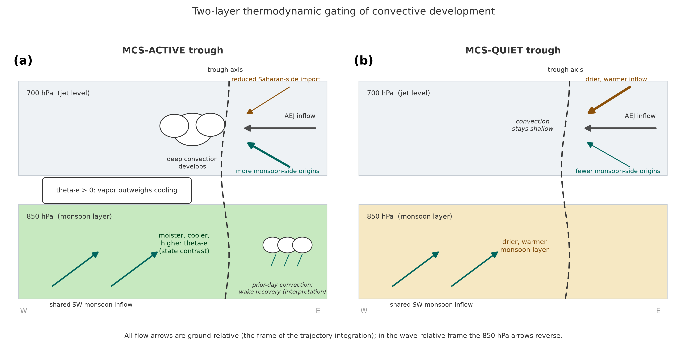

# African Easterly Waves and Mesoscale Convective Systems

A reproducible Python toolkit for analyzing how African easterly waves (AEWs) organize the
mesoscale convective systems (MCS) that produce most of the Sahel's summer rainfall. It
reproduces the composite analyses of Semunegus et al. (2017, International Journal of
Climatology) from source data and extends them with independent data pathways and a
wave-following composite framework.

The scientific target is the coupling between the westward-propagating African easterly
wave and the large thunderstorm clusters that travel with it, meaning where the storms sit
relative to the wave, how that depends on wave amplitude, and how the thermodynamic
environment flowing into a trough differs between waves that organize deep convection and
waves that do not.



Summary schematic. An MCS-active trough (left) draws less dry Saharan air at the jet level
(700 hPa) over a moister, cooler monsoon layer (850 hPa), and deep convection develops. An
MCS-quiet trough (right) shares the same southwesterly monsoon inflow but takes drier,
warmer air aloft, and convection stays shallow. Transport differences are drawn in the
700 hPa arrows and state differences in the 850 hPa fill. All flow arrows are
ground-relative.

## What it does

- Space-time (wavenumber-frequency) wave filtering of 700 hPa meridional wind, isolating
  westward zonal wavenumbers -20 to 0 and periods of 2.5 to 10 days (Frank and Roundy 2006).
- Composite-date selection at a basepoint (local maxima above a standard-deviation threshold).
- Longitude-lag (Hovmoller) and longitude-latitude composites with a Monte Carlo significance
  test whose null draws from the same calendar dates in other years.
- Cloud-system count binning into wave-relative coordinates, with anomalies against a matched
  null.
- An in-house convective-system tracker built from GridSat-B1 infrared brightness temperature
  (cold-cloud detection, equivalent-radius sizing, area-overlap linking with motion projection).
- A wave-following (trough-relative) composite that composites convection about the moving
  wave trough using the NCEI African Easterly Wave Climatology trajectories.

## Validated results

- The published basepoint composite reproduces exactly: 272 composite dates at a filtered-wind
  threshold of 3.26136 m/s (standard deviation 1.63068 m/s) at 10 N, 0 E.
- The space-time filter run on free ERA5 winds reproduces the original ERA-Interim wave series
  at a correlation of 0.92 over 2000 to 2004.
- The in-house GridSat-B1 tracker reproduces the original ISCCP convective-system spatial
  pattern at a correlation of 0.90 (full grid) and 0.84 (occupied cells) over twelve July to
  September months, matching the ISCCP baseline at least as well as an existing published
  product.
- In the wave-following composite, MCS counts peak in and just west of the moving trough,
  a maximum that survives an anchor-permutation null in which whole waves keep their track shapes while anchor longitudes are permuted within year-month strata, and stronger troughs
  organize convection more sharply.

## Install and test

```
python3.12 -m venv .venv && source .venv/bin/activate
pip install -e .
pytest -q
```

The unit tests need only the library core above. Reproducing the full analysis needs the
plotting and statistics packages as well, and the exact versions that produced the
published record are pinned in `requirements-lock.txt`:

```
pip install -r requirements-lock.txt && pip install -e ".[canonical]"
```

The library (`aew`) has unit tests on synthetic inputs for every numerical operator: the
filter, composite-date selection, both composite engines, the binning routines, the tracker,
and the dataset readers.

## Data

No data is bundled. The analysis reads from public archives:

- ERA5 winds: Copernicus Climate Data Store (`aew.data.era5` includes download helpers).
- GridSat-B1 brightness temperature: NOAA NCEI (Knapp et al. 2011).
- African Easterly Wave Climatology: NOAA NCEI dataset C00784 (Belanger et al.).
- Huang et al. (2018) MCS dataset: PANGAEA.
- ISCCP Convective System and Convective Tracking databases (Machado et al. 1998): NASA/NCEI.

Place inputs under `data/` and point the scripts in `scripts/` at them. See `docs/METHODS.md`
for the full method and `docs/PLAIN_SUMMARY.md` for a non-technical overview.

## Layout

```
src/aew/        filtering, events, composites, binning, tracks, plotting, data readers
scripts/        end-to-end figure and analysis drivers
tests/          synthetic-input unit tests
docs/           methods and plain-language summaries
```

## Citation

If this code supports your work, please cite the original analysis and this repository:

Semunegus, H., et al. (2017), Characterization of convective systems and their association
with African easterly waves, International Journal of Climatology.

## License

CC0 1.0 Universal (public domain dedication). See `LICENSE`.

## Author

Hilawe Semunegus.
