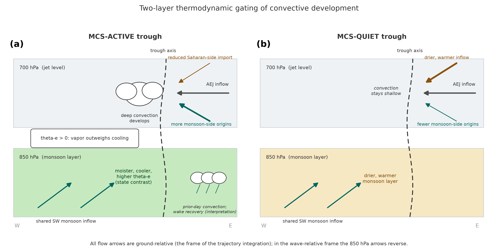

# African Easterly Waves and Mesoscale Convective Systems

A reproducible Python toolkit for studying African easterly waves (AEWs), the westward-moving
disturbances that organize much of the summer rainfall over West Africa and precede many
Atlantic tropical cyclones, and the mesoscale convective systems (MCS) that travel with
them. The repository began as a reproduction of one published analysis. It has grown into two
lines of work, one on how the waves organize convection and one on the record of the waves
themselves.

## How the work developed

### Reproducing a published analysis

The starting point was Semunegus et al. (2017), whose
composites of convective systems around African easterly waves were built with scripts in
the NCAR (National Center for Atmospheric Research) Command Language from a curated set of
inputs. The first task was to rebuild that analysis in Python from
source data and to reproduce it exactly rather than approximately. The published basepoint
composite now reproduces with the same 272 composite dates at the same filtered-wind threshold,
3.26136 m/s (standard deviation 1.63068 m/s) at 10 N, 0 E.

### Replacing the inputs with open data

Each input was then replaced by an openly available one, so that the analysis no longer
depends on data that is hard to obtain. The space-time filter run on ERA5 winds reproduces the
original ERA-Interim wave series at a correlation of 0.92 over 2000 to 2004. An in-house
convective-system tracker built on GridSat-B1 brightness temperature reproduces the pattern of
the original International Satellite Cloud Climatology Project (ISCCP) convective systems at a correlation of 0.90 over the full grid (0.84 over occupied
cells) for twelve July to September months, which matches the ISCCP baseline at least as well
as an existing published product.

### Following the waves

A composite at a fixed point averages over waves that pass at different latitudes and speeds.
The wave-following composite places convection relative to the moving trough instead, using the
trajectories of the African Easterly Wave Climatology (AEWC, Belanger et al. 2016) held by the
National Centers for Environmental Information (NCEI) of the National Oceanic and Atmospheric
Administration (NOAA).
MCS counts peak in and just west of the moving trough, a maximum that survives a permutation
test in which whole waves keep their track shapes while their anchor longitudes are shuffled
within year and month, and stronger troughs organize convection more sharply. A paper on
the thermodynamic contrasts between convectively active and quiet waves (Semunegus, 2026b)
is under consideration at the Journal of the Atmospheric Sciences.



Summary schematic. An MCS-active trough (left) draws less dry Saharan air at the jet level
(700 hPa) over a moister, cooler monsoon layer (850 hPa), and deep convection develops. An
MCS-quiet trough (right) shares the same southwesterly monsoon inflow but takes drier,
warmer air aloft, and convection stays shallow. Transport differences are drawn in the
700 hPa arrows and state differences in the 850 hPa fill. All flow arrows are
ground-relative.

### From using the wave record to rebuilding it

The wave-following work depends on the AEWC trajectories, which a MATLAB tracker produced in
2013 from ERA-Interim, a reanalysis that has since been discontinued. Carrying the record
forward to ERA5 required understanding that tracker in detail first. It was ported to Python
(`src/aew/v1port`) and run against the original, under Octave, on identical input. The two
agree exactly apart from a small residue. Of 48 residue items examined, 38 were reproduced by
a controlled change at a single timestep in how the two implementations follow contours of
the same field, and the other ten remain unresolved.
The port keeps the original's known defects on purpose, so that any later improvement enters
as an explicit, labeled option rather than a silent change.

A common protocol (`docs/aewc_v2/REANALYSIS_COMPARISON_PROTOCOL.md`) then fixed, before any
comparison was made, how the one tracker implementation runs on ERA-Interim and on ERA5, from
the input grid through the threshold calibration to the reporting season. Under that protocol
the tracker ran every year from 1979 to 2010 on both reanalyses, 64 runs in all, with each
run's outputs bound to its inputs by digest. Two threshold experiments followed, one on each
reanalysis, each testing how that record changes when its detection thresholds are replaced
by a specified alternative pair.

### Comparing with an independent record

QTrack (Lawton et al. 2022) is a different AEW tracker with a published ERA5 record. Comparing
two tracker records measures how they correspond, not whether either is right, and the tools
here are built for that comparison alone. They pair stored tracks one to one under rules
fixed in advance, measure whether each record's tracks that start over Africa are recorded on
the Atlantic side of the West African coast by the end of October, break that measurement
down by where and when tracks start, and read individual cases against the tracker's own
input fields. Every measurement counts stored tracks, reports its denominators, and records
the digests of its inputs. The results will be reported with the version 2 record.

## Where it is going

The aim is a documented, reproducible version 2 of the African Easterly Wave Climatology on
ERA5, produced under the declared protocol, with its differences from the ERA-Interim record
and from QTrack characterized and published alongside it. Two questions remain open. The
first is how the two records compare for waves that start over eastern Africa, which bears
directly on studies of where the waves originate. The second is what criterion should decide
whether a change to the tracker is an improvement, since reproducing version 1 does not
answer that. The repository will record how each is settled.

## What it does

- Space-time (wavenumber-frequency) wave filtering of 700 hPa meridional wind, isolating
  westward zonal wavenumbers -20 to 0 and periods of 2.5 to 10 days (Frank and Roundy 2006).
- Composite-date selection at a basepoint (local maxima above a standard-deviation threshold).
- Longitude-lag (Hovmoller) and longitude-latitude composites with a Monte Carlo significance
  test whose null draws from the same calendar dates in other years.
- Cloud-system count binning into wave-relative coordinates, with anomalies against a matched
  null.
- An in-house convective-system tracker built from GridSat-B1 infrared brightness temperature
  (cold-cloud detection, equivalent-radius sizing, area-overlap linking with motion projection).
- A wave-following (trough-relative) composite that composites convection about the moving
  wave trough using the AEWC trajectories.
- A Python port of the AEWC version 1 tracker (`aew.v1port`), with its region, threshold and
  validation code.
- A restart-safe driver for the reanalysis protocol campaign and a check that binds every
  run to its inputs (`scripts/run_protocol_campaign.sh`, `scripts/check_campaign_bindings.py`),
  and threshold-sensitivity replays from frozen code snapshots
  (`scripts/run_threshold_sensitivity.py`).
- Tools for the comparison with QTrack's published record: one-to-one pairing (`aew.pairing`,
  `scripts/qtrack_pairing_pilot.py`), the descriptive coast-crossing measurement and its
  breakdown by start longitude and month (`scripts/coast_crossing_measurement.py`,
  `scripts/coast_crossing_origin.py`, `scripts/coast_crossing_by_month.py`), and case readings
  (`scripts/continuity_case_reading.py`).

## Install and test

```
python3.12 -m venv .venv && source .venv/bin/activate
pip install -e ".[plot,stats,dev]"
pytest -q
```

This is the installation the continuous-integration tests use. The library core alone
(`pip install -e .`) imports and runs the tracker, and reproducing the full analysis with the
exact package versions that produced the published record uses the pins in
`requirements-lock.txt`:

```
pip install -r requirements-lock.txt && pip install -e ".[canonical]"
```

The library (`aew`) has unit tests on synthetic inputs for every numerical operator, covering
the filter, composite-date selection, both composite engines, the binning routines, the
tracker, the dataset readers, the version 1 port, and the comparison tools.

## Data

No data is bundled. The analysis reads from public archives:

- ERA5 and ERA-Interim winds: the European Centre for Medium-Range Weather Forecasts
  (ECMWF), through the Copernicus Climate Data Store for ERA5 (`aew.data.era5` includes
  download helpers).
- GridSat-B1 brightness temperature: NOAA's NCEI (Knapp et al. 2011).
- African Easterly Wave Climatology: NOAA's NCEI dataset C00784 (Belanger et al. 2016).
- QTrack ERA5 AEW tracks: Zenodo record 14338645 (Lawton et al. 2022).
- Huang et al. (2018) MCS dataset: PANGAEA.
- ISCCP Convective System and Convective Tracking databases (Machado et al. 1998): the
  National Aeronautics and Space Administration (NASA) and NCEI.

Place inputs under `data/` and point the scripts in `scripts/` at them. See `docs/METHODS.md`
for the full method and `docs/PLAIN_SUMMARY.md` for a non-technical overview.

## Layout

```
src/aew/          filtering, events, composites, binning, tracks, plotting, data readers, pairing
src/aew/v1port/   the Python port of the AEWC version 1 tracker
scripts/          end-to-end figure, campaign and comparison drivers
tests/            synthetic-input unit tests
docs/             methods, plain-language summary, and the version 2 reanalysis protocol
```

## Citation

If this code supports your work, please cite the relevant paper and this repository.

Semunegus, H. (2026a). *African easterly waves and mesoscale convective systems* [Computer
software]. GitHub. https://github.com/hilawe/african-easterly-waves

Semunegus, H. (2026b). *Between-wave thermodynamic contrasts ahead of convectively active
African easterly waves* [Manuscript submitted for publication]. NOAA's National Centers for
Environmental Information.

Semunegus, H., Mekonnen, A., & Schreck, C. J., III. (2017). Characterization of convective
systems and their association with African easterly waves. *International Journal of
Climatology*, *37*(12), 4486-4492. https://doi.org/10.1002/joc.5085

## License

CC0 1.0 Universal (public domain dedication). See `LICENSE`.

## Author

Hilawe Semunegus.
